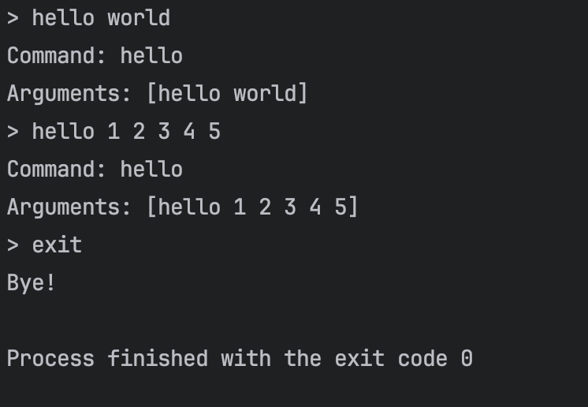
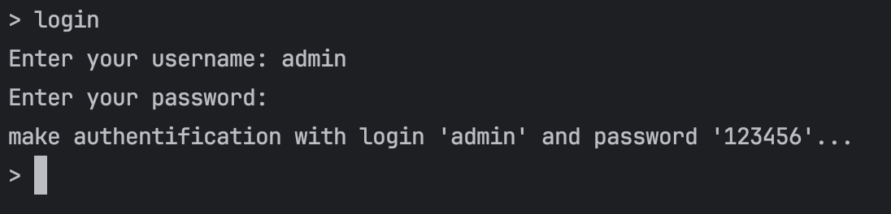

# gocommand


**Gocommand** is the simplest way to create a command line interface throw stdin/out for your Go application. It provides a simple way to read commands and arguments from the standard input and execute them.

## Usage 

### Simple command read

```go
package main

import (
	"fmt"
	"github.com/nessai1/gocommand"
)

func main() {
	gocommand.ListenAndServe(func(cmd *gocommand.Command) error {
		if cmd.Name == "exit" {
			return gocommand.ErrGracefulExit
		}

		fmt.Printf("Command: %s\n", cmd.Name)
		fmt.Printf("Arguments: %v\n", cmd.Args)

		return nil
	})
}
```

Output:<br>



### Prompting the user for input

Library allows you to ask user for input using the `AskText` and `AskSecret` functions

- `AskText` function asks the user for a text input and returns it as a string
- `AskSecret` function asks the user for a sensitive data and returns it as a string

```go
package main

import (
	"fmt"
	"github.com/nessai1/gocommand"
)

func main() {
	gocommand.ListenAndServe(func(cmd *gocommand.Command) error {
		if cmd.Name == "exit" {
			return gocommand.ErrGracefulExit
		}

		if cmd.Name == "login" {
			login, err := gocommand.AskText("Enter your username")
			if err != nil {
				return fmt.Errorf("cannot ask login: %w", err)
			}

			password, err := gocommand.AskSecret("Enter your password")
			if err != nil {
				return fmt.Errorf("cannot ask password: %w", err)
			}

			fmt.Printf("make authentification with login '%s' and password '%s'...\n", login, password)
		}

		return nil
	})
}
```

Output:<br>
